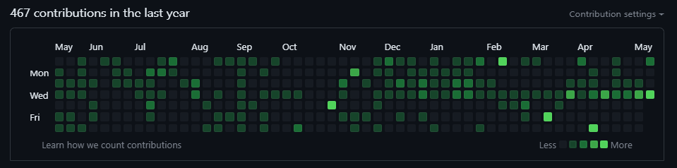

 

I like solving problems and developing websites. I like learning how things work and how to improve apon them. Finding challenges that get me thinking and seeing a project come to life.

### 🤝 Connect with me:

 
- 💬 If you have any question/feedback, please do not hesitate to reach out to me!

## 🔭 I'm currently working on

- Vaction Finder App
- A Budget creator App
- Recipe creater App

## 🌱 I'm currently learning

- JavaScript
- AWS Pipline
- REST APIs  

## 💼 Technical Skills

 

 

## 📈 GitHub Stats 

